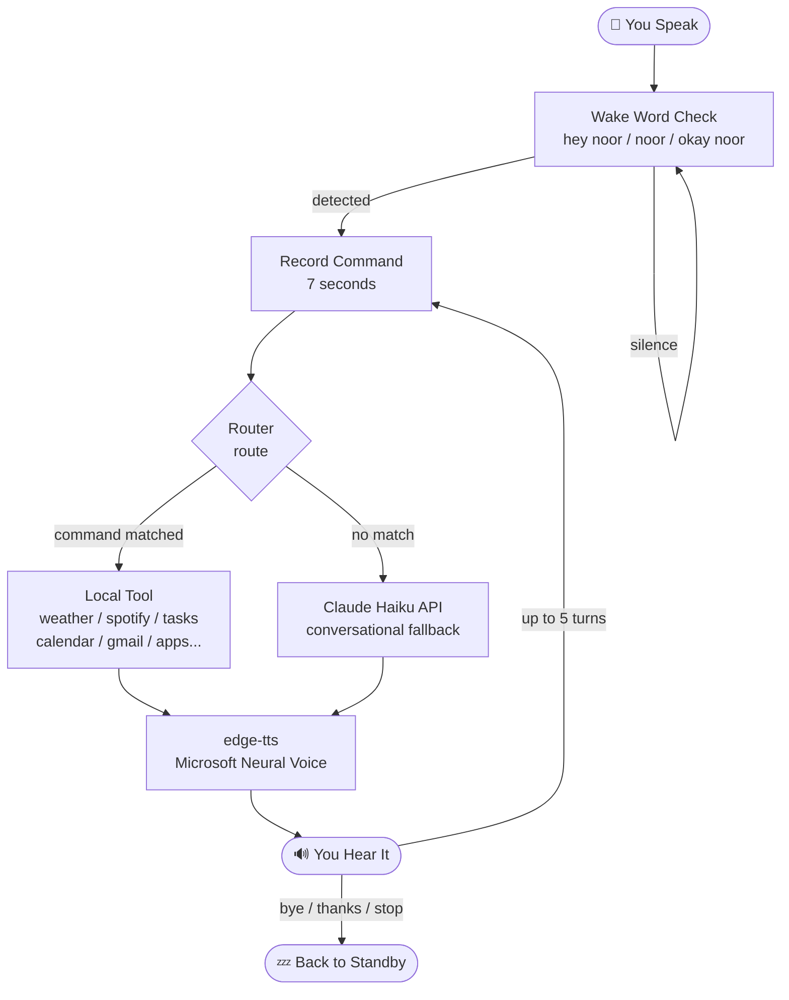
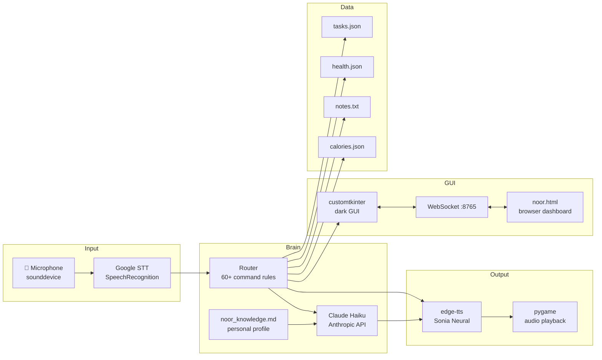

# N.O.O.R — Personal AI Assistant

A voice-activated personal AI assistant for Windows. Talks back. Controls your computer. Knows your context. Runs entirely locally — no cloud deployment, no subscription.

Windows 11 · Python 3.11 · Always listening · Always ready

---

## How It Works



---

## System Components



---

## Folder Structure

```
N.O.O.R/
│
├── main.py                  ← Entire app: GUI + voice + tools + routing (2100+ lines)
├── config.py                ← Your API keys — never committed (in .gitignore)
├── config.example.py        ← Template — copy this to make config.py
│
├── noor.html                ← Browser-based HUD dashboard (connects via WebSocket)
├── noor.vbs                 ← Silent desktop launcher (no black console window)
├── launch.bat               ← Terminal launcher with port cleanup
│
├── requirements.txt         ← pip install -r requirements.txt
├── test_jarvis.py           ← 9 routing tests (all passing)
│
├── google_credentials.json  ← Google OAuth creds (not committed — .gitignore)
├── google_token.json        ← Saved Google token (auto-generated, not committed)
│
├── tayyab_review/
│   └── HOW_IT_WORKS.md      ← Plain English explanation of every decision made
│
└── data/                    ← All local data (not committed — .gitignore)
    ├── tasks.json           ← Task list
    ├── health.json          ← Meal logs
    ├── workout.json         ← Training split + session logs
    ├── calories.json        ← Daily calorie totals
    └── notes.txt            ← Voice notes with timestamps
```

---

## GUI Layout

```
┌──────────────────────────────────────────────────────────────────┐
│  N . O . O . R                              PERSONAL AI  v1.0    │
│  ─────────────────────────────────────────────────────────────   │
├──────────────────┬────────────────────────────┬──────────────────┤
│                  │                            │                  │
│   📋 TASKS       │         ● STANDBY          │   📅 CALENDAR    │
│  ─────────────   │      (LISTENING = green)   │   ────────────   │
│  ☐ task one      │      (PROCESSING = amber)  │   May 2026       │
│  ☐ task two      │      (SPEAKING = cyan)     │   Mo Tu We Th Fr │
│  ☑ done task     │                            │    1  2  3  4  5 │
│                  │   "what you said..."        │    ●           ● │
│  + Add Task      │   ─────────────────────    │   12 13 14 15 16 │
│                  │   "noor's response here"    │                  │
│  ─────────────   │                            │  ─────────────── │
│   ⏱ TIMER        │  [WEATHER] [NEWS] [BRIEF]  │   🗺 MAPS        │
│   00:00          │  [HEALTH]  [EMAIL] [SCREEN] │                  │
│  START   RESET   │                            │  UCD  CITY  HOME │
│                  │  ▓▓▓▓▓░░░░  mic level       │                  │
└──────────────────┴────────────────────────────┴──────────────────┘
```

---

## Tech Stack

| Component | Library | Why chosen |
|---|---|---|
| GUI | `customtkinter` | Modern look, runs natively on Windows |
| Voice input | `SpeechRecognition` + Google STT | Free, no API key, good accuracy |
| AI brain | Claude Haiku (`anthropic` API) | Fast (< 1s), cheap, perfect for short replies |
| Voice output | `edge-tts` (Microsoft Neural) | Free, no key needed, high quality |
| Audio playback | `pygame` | Reliable, handles mp3 streams well |
| Spotify | `spotipy` | Official Spotify API wrapper |
| Calendar + Gmail | `google-api-python-client` | Official Google OAuth2 API |
| System stats | `psutil` | CPU, RAM, disk, process info |
| Mic stream | `sounddevice` + `numpy` | Low-latency input for level meter |
| Web requests | `requests` | Weather (Open-Meteo), news (RSS), GitHub |

---

## Wake Words

N.O.O.R listens continuously. Say any of these to activate:

```
Primary:   "Hey Noor"  ·  "Noor"  ·  "Okay Noor"
Also:      "Hello Noor"  ·  "Yo Noor"  ·  "Wake up Noor"

STT variants (accent + mishearing coverage):
           "hey nor"  ·  "hey nur"  ·  "hey nore"
           "hey new"  ·  "hey nu"  ·  "a noor"
```

After activation: up to **5 conversation turns** without repeating the wake word.

**To end:** say `"thanks"` · `"bye"` · `"stop"` · `"that's all"` · `"dismiss"`

---

## All Voice Commands

### Info & Briefings
| Command | What happens |
|---|---|
| `"Morning briefing"` | Date, weather, news, calendar events, email summary |
| `"What's the weather"` | Dublin weather (Open-Meteo, no key needed) |
| `"Weather in [city]"` | Any city worldwide |
| `"Tell me the news"` | World headlines via RSS |
| `"Irish news"` / `"Tech news"` / `"AI news"` | Topic-filtered headlines |
| `"System info"` | CPU %, RAM %, disk %, uptime |

### Google Calendar
| Command | What happens |
|---|---|
| `"What do I have today"` | Today's events |
| `"My week"` / `"Events this week"` | Next 7 days |
| `"Add a meeting at 3pm tomorrow"` | Creates Calendar event |
| `"I have a lecture at 9am"` | Creates event + adds task |
| `"Open Google Calendar"` | Opens calendar.google.com |

### Gmail
| Command | What happens |
|---|---|
| `"Check my email"` | Today's inbox summary |
| `"Yesterday's emails"` | Last 2 days |
| `"Send an email to [name]"` | Compose and send via Gmail |

### Tasks & Notes
| Command | What happens |
|---|---|
| `"Add task [text]"` | Adds to task list in GUI |
| `"Remove task [text]"` | Deletes matching task |
| `"Take a note [text]"` | Timestamped note saved |
| `"Read my notes"` | Reads notes back |

### Spotify
| Command | What happens |
|---|---|
| `"Play"` / `"Pause"` / `"Skip"` / `"Previous"` | Playback control |
| `"What's playing"` | Current song + artist |
| `"Like this song"` | Saves to Liked Songs |
| `"Play [artist/song]"` | Search and play |
| `"Open Spotify"` | Launches Spotify app |

### Health & Fitness
| Command | What happens |
|---|---|
| `"I ate chicken and rice"` | Logs meal, estimates macros via Claude |
| `"I had 500 calories"` | Logs calorie count |
| `"Log workout chest and back"` | Logs session |
| `"Health summary"` | Daily meals, calories, macros |
| `"What's my workout today"` | Today's training split |
| `"Calories today"` | Logged vs daily goal |

### Apps & Websites
| Command | What happens |
|---|---|
| `"Open Chrome / VS Code / Discord / Notepad"` | Launches app |
| `"Open YouTube / GitHub / Netflix / Notion"` | Opens in browser |
| `"Open UCD"` / `"Open Blackboard"` | University sites |
| `"Search Google for [topic]"` | Opens browser with search |

### Computer Control
| Command | What happens |
|---|---|
| `"Type [text]"` | Types at current cursor position |
| `"Press Ctrl+C"` | Fires any keyboard shortcut |
| `"Read my screen"` | Screenshot → AI analysis |
| `"Explain code"` | Reads clipboard, explains it |
| `"Volume up / down / mute"` | System audio control |
| `"Volume to 60"` | Sets exact level |
| `"Lock screen"` | Locks Windows |
| `"Take a screenshot"` | Saves screenshot |
| `"Remind me in 10 minutes to [x]"` | Timed reminder |

### Maps & GitHub
| Command | What happens |
|---|---|
| `"Directions to [place]"` | Google Maps route |
| `"Where is [place]"` | Opens Maps location |
| `"My repos"` / `"GitHub issues"` | Lists your repos / open issues |

---

## Setup

### 1. Clone and install
```bash
git clone https://github.com/tayyabali297/NOOR.git
cd NOOR
pip install -r requirements.txt
```

### 2. Create config.py
```bash
cp config.example.py config.py
```
Then fill in your keys:
```python
CLAUDE_API_KEY = "sk-ant-..."        # console.anthropic.com
SPOTIFY_CLIENT_ID = "..."             # developer.spotify.com
SPOTIFY_CLIENT_SECRET = "..."
GITHUB_TOKEN = "..."                  # optional
```

### 3. Google Calendar + Gmail (optional)
1. Go to [Google Cloud Console](https://console.cloud.google.com)
2. Enable the **Calendar API** and **Gmail API**
3. Create OAuth 2.0 credentials → download as `google_credentials.json`
4. Place `google_credentials.json` in the project folder
5. First run will open a browser to approve access — one time only

### 4. Create your personal profile (optional but recommended)
Create `noor_knowledge.md` in the project folder. Write anything you want N.O.O.R to know about you — goals, schedule, preferences. This gets loaded into every Claude prompt. See `config.example.py` for ideas.

### 5. Run
```bash
py -3.11 main.py
```
Or double-click `N.O.O.R` on the desktop.

---

## Data Storage

All data is stored locally in `data/` as plain JSON — readable in any text editor, never committed to git.

```
data/tasks.json      → [{"text": "Buy groceries", "done": false}, ...]
data/calories.json   → {"2026-05-25": 2340, ...}
data/health.json     → meal logs with macro estimates
data/workout.json    → weekly training split + session history
data/notes.txt       → [2026-05-25 09:14] your note here
```

---

## Troubleshooting

| Problem | Fix |
|---|---|
| App won't start | Check `config.py` exists with `CLAUDE_API_KEY` set |
| Wake word not triggering | Check microphone is default in Windows Sound settings |
| N.O.O.R hears itself | Normal — `is_speaking` flag mutes mic during TTS. If it still triggers, raise `energy_threshold` in main.py ~line 143 |
| Google Calendar broken | Ensure `google_credentials.json` is in project folder, run once to approve |
| Spotify not responding | Spotify must be open. Verify client ID/secret in config.py |
| Shortcut gives "file not found" | Right-click shortcut → Properties → fix the target path |

---

## Running Tests

```bash
py -3.11 test_jarvis.py
```

9 tests covering: weather, news, Spotify, tasks, notes, workouts, meals, calories, calendar routing. All should pass.
